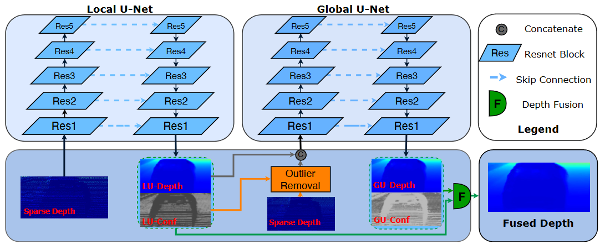

# CU-Net Model for LiDAR Depth Completion



## Position Encoding

Additionally, this model performs position encoding in different modes
(which was not mentioned in the paper but is used in the authors'
implementation). There are four encoding modes in total:

- **xyz**: From the depth map and normalized pixel coordinates, we compute
  3D point positions using the camera intrinsic matrix (back-projection).
- **uv**: We use two matrices of normalized pixel coordinates (unorm, vnorm),
  each ranging from -1 to 1.
- **z**: We simply use the depth map as the positional feature.
- **std**: No position encoding is applied.

For each spatial scale of the encoder, a position feature tensor is
created and concatenated to the input of each convolutional block
at that scale.

## Local U-Net Architecture (or Ben)

> In the codebase this branch is called **Ben**, and the Global U-Net is called **Jin**. Below they are referred to as **LU** (Local U-Net) and **GU** (Global U-Net).

- Get geometry features based on encoding mode for each scale.
- **Encoder**:
  - 5 levels of downsampling via strided convolution (stride=2).
    Each level consists of 4 residual blocks (`BasicBlockGeo` in original code).  
    Each residual block:
    `cat(x, geo1)` → Conv3x3 → BN → ReLU → `cat(out, geo2)` → Conv3x3 → BN → + shortcut (residual) → ReLU.
- **Decoder**:
  - 5 levels of upsampling (ConvTranspose2d → BN → ReLU → element-wise add with the corresponding encoder feature map).
- One residual refinement block (`BasicBlock`: Conv3x3 → BN → ReLU → Conv3x3 → BN → + shortcut (residual), without final ReLU).
- `conv1x1` to get the depth map output.
- `conv1x1` + Sigmoid to get the confidence map output.

## Global U-Net Architecture (or Jin)

- **Input preparation** — delete outliers from the sparse depth map using the algorithm from the paper:

  Create confidence, confusion and valid pixels masks by binary thresholding of the **LU confidence map** (`lu_conf`):
  - **confidence mask**: 1 where `lu_conf >= 0.7`, 0 elsewhere.
  - **confusion mask**: 1 where `lu_conf < 0.7`, 0 elsewhere (inverse of confidence mask).
  - **valid pixels mask**: 1 where `depth > 0.1`, 0 elsewhere.

  Using the predefined diamond-shaped convolution kernels (7×7, 13×13), which are designed to capture
  neighboring pixels, we perform outlier removal:
  - Calculate mean depth value of neighboring pixels for each pixel using both kernels:
    - `lidar_sum = conv(depth)`
    - `lidar_count = conv(valid_pixels_mask)`
    - `lidar_mean = lidar_sum / (lidar_count + 1e-5)`
  - Create potential outliers mask: 1 where `(depth - lidar_mean) > 1.0` (for 7×7 kernel) or `> 0.7` (for 13×13 kernel), 0 elsewhere. Note: no `abs()` — only points **above** the local mean are considered outliers.
  - Final potential outliers mask = `potential_outliers_7x7 + potential_outliers_13x13`
  - Final cleared depth map:
    ```
    d_clear = depth * confidence_mask
            + depth * (1 - potential_outliers) * confusion_mask * valid_pixels_mask
    ```

- **Encoder**:
  - Input: concatenation of `lu_depth` processed through a conv layer (48 channels) and `d_clear` through another conv layer (16 channels), giving 64 channels total. This differs from the LU branch, which takes only sparse depth `d` through a single conv layer (64 channels).
  - The rest of the encoder has the same architecture as the local U-Net encoder.

- **Decoder**:
  - The same architecture as the local U-Net decoder.

## Fusion

- Concatenate both confidence maps from LU and GU along the channel dimension into a 2-channel tensor, apply Softmax (along channels), then split back into two single-channel maps. This ensures that for each pixel `lu_conf + gu_conf = 1`.
- Calculate the final depth map as a per-pixel convex combination:
  ```
  fused_depth = lu_conf * lu_depth + gu_conf * gu_depth
  ```

## Loss Computation

- Compute the MSE (L2) loss ignoring invalid pixels (where `depth_gt <= 0`) for the local depth map, global depth map, and final depth map, then do a weighted sum.

$$L(D) = \frac{1}{|\mathcal{V}|}\sum_{p \in \mathcal{V}} (D_p - D_{gt,p})^2, \quad \mathcal{V} = \{p : D_{gt,p} > 0\}$$

$$L_{total} = \lambda_{lu} \cdot L(D_{lu}) + \lambda_{gu} \cdot L(D_{gu}) + \lambda_{fused} \cdot L(D_{fused})$$